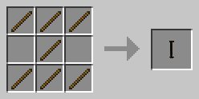
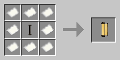
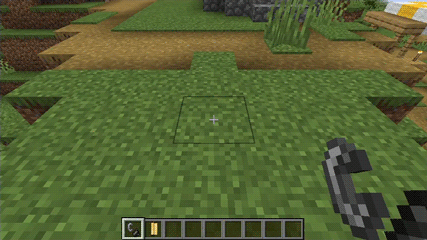
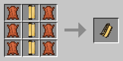
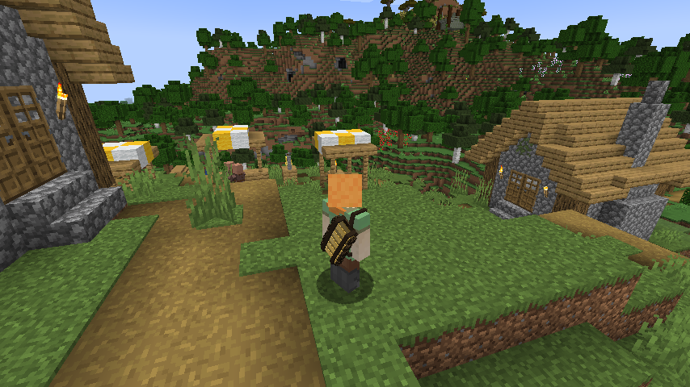
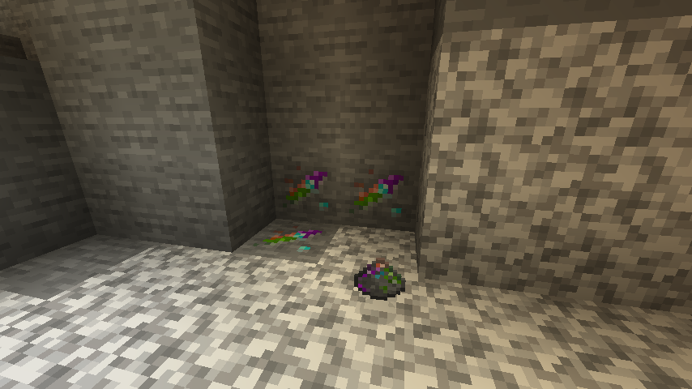
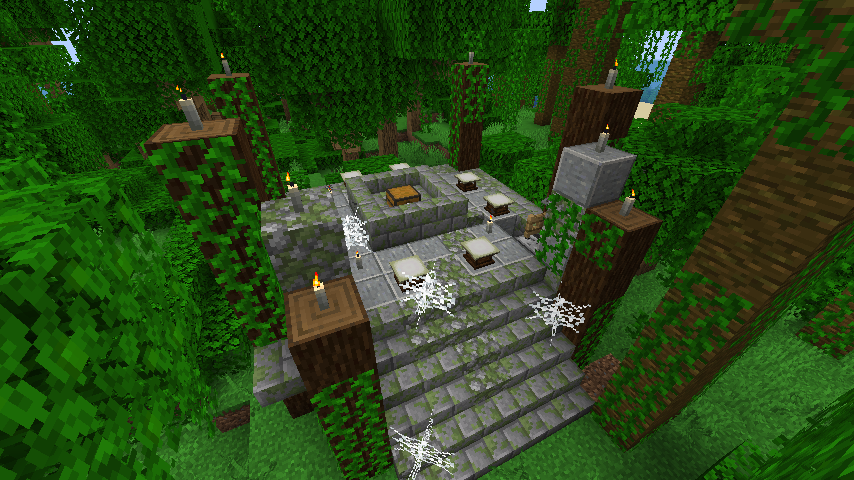
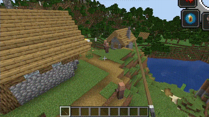

# 卷轴魔法

为 MC 添加 6 种魔法

- [卷轴魔法](#卷轴魔法)
  - [卷轴](#卷轴)
  - [卷轴背带](#卷轴背带)
  - [魔法](#魔法)
  - [蕴魔矿](#蕴魔矿)
  - [祭坛](#祭坛)
  - [平和魔杖](#平和魔杖)

---

## 卷轴

使用木棍和纸合成 `空卷轴`

将 `空卷轴` 丢至对应方块/物品，合成魔法卷轴

| 物品/方块  | 魔法卷轴 |
| ---------- | -------- |
| 火焰       | 火焰卷轴 |
| 冰块       | 冻结卷轴 |
| 滴水石锥   | 石滴卷轴 |
| 末影之眼   | 虚绳卷轴 |
| 滞留剧毒II | 剧毒卷轴 |
| 生命恢复II | 治愈卷轴 |

将卷轴置于副手，`右键` 展开，`左键` 施展魔法，每张卷轴只可使用一次

## 卷轴背带

可穿戴的卷轴背包

穿着时按 `g` 打开背带，可向内放置卷轴

当背带内有卷轴时，可直接 `右键` 取出卷轴使用

## 魔法

燃烧

冻结

中毒

石滴

虚绳

治愈

## 蕴魔矿

在和生成的矿物，也可在 [祭坛](#祭坛) 中央找到，挖掘后得到蕴魔粉末

## 祭坛

用于召唤魔法和蕴魔聚合物的结构

祭坛在以下群系中生成：
- 丛林
- 森林
- 针叶林
- 沙漠
- 平原
- 雪原
- 向日葵平原
- 热带草原
- 热带高原
- 风袭热带草原

在 8 个祭台上放置同类物品后，使用蕴魔粉末右键蕴魔矿进行召唤

当物品为卷轴时，召唤大范围魔法

当物品为蕴魔矿时，召唤蕴魔聚合物

打败蕴魔聚合物后，获得魔杖核心

## 平和魔杖

0 消耗使用任意魔法的强力武器

使用 `R` + `滚轮` 切换魔法，长按 `右键` 后松开施展施展

