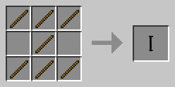
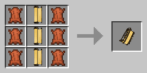
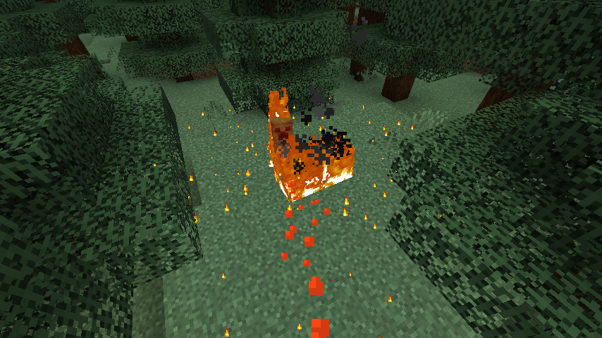
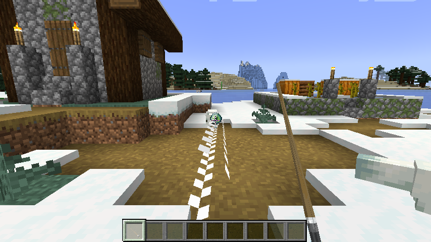
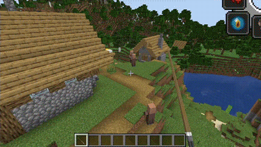

# ScrollMagic

Adds 6 spells to the MC

- [Scroll Magic](#scrollmagic)
- [scroll](#scroll)
- [scrollbelt](#scrollbelt)
- [magic](#magic)
- [MagicOre](#magicore)
- [Altar](#altar)
- [BaseWand](#basewand)

---

## Scroll

Using sticks and paper to form an 'empty scroll'

Drop the 'empty scroll' onto the corresponding block/item to create a magic scroll

| item/cube | Magic Scroll |
| ---------- | -------- |
| Flame | Flame scroll |
| ice cube | freeze reel |
| dripping cone | Dripping scroll |
| Eye of Ender | the Phantom Scroll |
| Retained Poison II | Poison Scroll |
| Life Restoration II | The Healing Scroll |

Put the scroll in the secondary, 'right' expand, 'left' cast magic, each scroll can only be used once

## ScrollBelt

Wearable scroll backpack

When wearing, press 'g' to open the strap and place the scroll inward

When there is a scroll in the strap, you can directly 'right click' take out the scroll to use

## Magic

Burning

Frozen

Poisoned

Stone drop

Virtual rope

cure

## MagicOre

The mineral that is generated in and can also be found in the center of [altar](# altar), which is excavated to obtain the aggregates powder

## Altar

A structure for summoning magic and aggregates

Altars are generated in the following groups:
- The jungle.
- The forest.
- The coniferous forest
- The desert.
- The plain.
- Snow fields.
- Sunflower Plains.
- Savanna.
- Tropical Plateau
- The wind hits the savanna

After placing similar items on 8 altars, use the powder to right-click the Skandome mine to summon

When the item is a scroll, summon a wide range of magic

Summon the aggregates when the item is the Aggregates

After defeating the aggregates, obtain the wand core

## BaseWand

None Consume powerful weapons that use any magic

Use the 'R' + 'Scroll wheel' to switch spells, long press the 'right button' and release to cast

